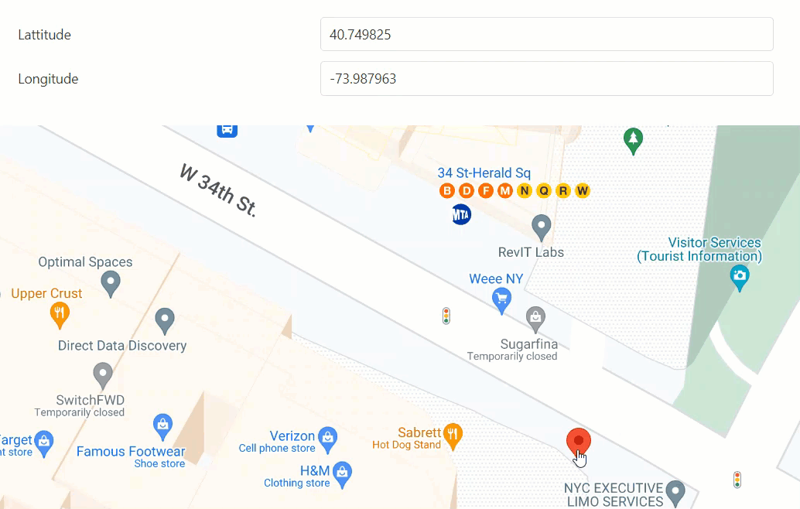

<!-- default badges list -->

<!-- default badges end -->

# Map for DevExtreme - How to add draggable markers

This example demonstrates how to add draggable markers to your Map component when you use Google as a provider.

## Files to Review

- **jQuery**
    - [index.html](jQuery/index.html)
    - [script.js](jQuery/script.js)

## Documentation

- [Map Overview](https://js.devexpress.com/Documentation/Guide/UI_Components/Map/Overview/)
- [Map - API Reference](https://js.devexpress.com/Documentation/ApiReference/UI_Components/dxMap/)

## See Also

- [Map for DevExtreme - How to add the current location marker](http://www.devexpress.com/Support/Center/Example/Details/E4734)
<!-- feedback -->
## Does this example address your development requirements/objectives?

 

(you will be redirected to DevExpress.com to submit your response)
<!-- feedback end -->
